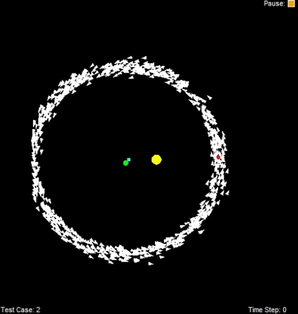

# Skyler Hawkins – Project Portfolio

**M.S. CS @ Georgia Tech | Focus: Artificial Intelligence**

_(Last updated: Nov 2025)_

**Legacy Portfolio Site Link (Check it out!):  [Penn State Portfolio](https://iskyhawk0.github.io/skylerhawkins/)**
---

## Fall '25 - Robotics for AI and Game AI

## 🤖 Robotics AI 

### Solar System Particle Filter – Satellite Localization

- **What it is:** Simulation project implementing a particle filter to localize a man-made satellite in a solar system using only noisy gravimeter measurements and a motion model.
- Over many days of simulated time, the filter fuses sensor readings and control inputs to recover the satellite’s unknown orbit around the sun to within 0.01 AU.
- **Tech:** Python · Particle filter · Probabilistic localization · Bicycle motion model · Noisy sensor fusion

**Description:** Shows the satellite in orbit while a cloud of particles starts spread across the solar system and gradually collapses onto the true trajectory as the filter incorporates new gravimeter readings and motion updates.
- SUN: Yellow circle in the middle
- OTHER PLANETS: Green circles
- SATELLITE POSITION: Red dot
- PREDICTED POSITION: Blue square
- PARTICLES: White triangles
  

---

## 🎮 Game AI

